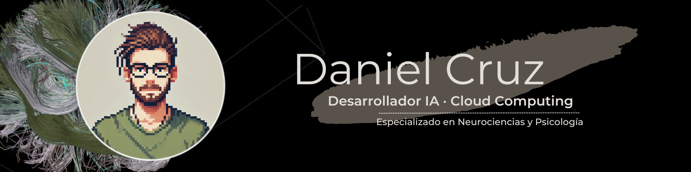

## 👋 Buenas! Bienvenido a mi repositorio, soy Daniel Cruz - *dCruzCoding*

Soy un apasionado de la **mente humana** y del **desarrollo de soluciones**, dos áreas donde entender el **procesamiento de la información** es esencial. Mi **perfil híbrido** me permite combinar disciplinas, que se retroalimentan entre sí, impulsando con **creatividad** y **dedicación** proyectos del sector **tecnológico** y/o **neurocientífico**.

## 🛠️ Tecnologías y Herramientas

### 💻 Lenguajes de programación
    

### 🌐 Desarrollo Web  
   

### 🗄️ Bases de datos
   

### 📊 Analisis de datos
   
 

### ⚡ Power Platform
 

### ☁️ Cloud y DevOps
    

### 🧠 Machine Learning & Deep Learning

#### Modelos Supervisados
    

#### Deep Learning
   

#### Procesamiento de Lenguaje Natural (NLP)  
    

#### Preprocesamiento y Optimización
   

#### Aprendizaje No Supervisado
  

#### Otros
 

### 🧩 Otras herramientas de interés
     

## 📈 Proyectos Destacados

### 📄☁️ [GCP-Resume-Summarizer](https://github.com/dCruzCoding/gcp-resume-summarizer) *(Demo funcional)*

**GCP-Resume-Summarizer** es un proyecto de demostración que, utilizando infraestructura **Google Cloud Platform**, despliega una solución serverless que genera resúmenes automáticos de cv utilizando modelos de lenguaje preentrenado (**BART-Large-CNN**) conectando con Hugging Face API. 

> ⚠️ Este proyecto tiene una finalidad **puramente educativa**: busca ilustrar cómo se integran distintas herramientas de GCP.
> Por ello, se han aceptado limitaciones importantes del modelo de resumen. 
> **No se recomienda su uso en entornos reales.**

### 🩺🥗 [NutriSynthCare](https://github.com/dCruzCoding/NutriSynthCare.git) *(V.1 released)*
**NutriSynthCare** es un proyecto de generación, unión e imputación de **bases de datos sintéticas** orientadas al estudio del riesgo cardiovascular y la diabetes, con un **enfoque clínico-preventivo**. Además del procesamiento de datos, se incluyen funcionalidades para generar **recomendaciones alimenticias personalizadas** basadas en **ontologías de nutrición y salud**.

🔎 El pipeline combina análisis exploratorio, técnicas estadísticas clásicas (como regresión lineal múltiple) y algoritmos de **machine learning** avanzados (**XGBoost**, **Random Forest**, **Redes Neuronales**).

🔗 Desarrollado en colaboración con [Anibal García](https://github.com/Aniballll).  
📊 Contiene múltiples notebooks documentados, bases de datos generadas e informes de referencias científicas.

### 🕹️🌿 [EcoSys](https://github.com/dCruzCoding/EcoSys.git)     *(V.2 released)*
**EcoSys** es una pequeña simulación visual de ecosistemas desarrollada en Python con Pygame. El proyecto permite experimentar con dinámicas básicas de población mediante dos modos de juego: **Supervivencia**, donde controlas a un individuo y debes sobrevivir el mayor tiempo posible, y **Simulación**, donde simplemente observas cómo evoluciona el ecosistema bajo ciertas condiciones iniciales.

Incluye elementos como reproducción, envejecimiento, conflictos entre individuos y un sistema de poderes en el modo Supervivencia. Aunque sencillo, EcoSys permite visualizar de forma entretenida cómo unas pocas reglas pueden dar lugar a comportamientos emergentes.

### 🐍 [PyPractice](https://github.com/dCruzCoding/PyPractice.git)     *(En proceso)*
Apuntes sobre programación en Python y ejercicios para practicar.

### 📦 [StockSmart](https://github.com/dCruzCoding/stocksmart.git)     *(En suspensión)*
Solución integral diseñada con tecnología de Azure para gestionar las existencias de productos de compañías que comercializan a través de Internet.

### ☁️ [Laboratorios Microsoft para el AZ-204](https://github.com/dCruzCoding/MicrosoftLabs-AZ204.git)     *(En suspensión)*
Proyectos para la formación en Microsoft Azure Cloud.

## 📫 ¿Cómo contactarme?

- **Correo**: [dcruzcoding@gmail.com](mailto:dcruzcoding@gmail.com)
- **LinkedIn**: [Daniel Cruz Jurado](https://www.linkedin.com/in/daniel-cruzjurado)

---

¡Gracias por visitar mi perfil! No dudes en conectarme si deseas charlar o proponer algo.
